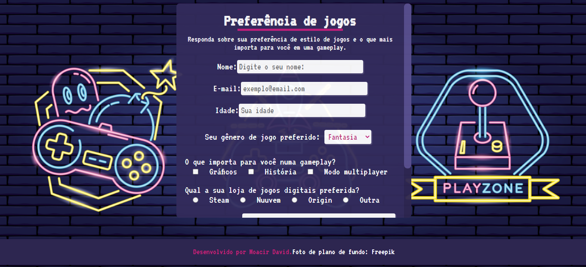

<h1>Formulário de pesquisa</h1>  

Projeto desenvolvido durante o curso <i>Responsive Web Design</i> da <b>FreeCodeCamp</b>
.

É um pequeno formulário de pesquisa, de domínio livre, que fiz com a temática de uma suposta pesquisa sobre preferências de jogos. <strong>O projeto me permitiu por em prática o que foi ensinado durante o curso sobre HTML5, CSS3 e seus conceitos de flexbox, por exemplo.</strong>

<h2>Conceitos utilizados:</h2>
<ul>
    <li>Tags semânticas;</li>
    <li>Flexbox;</li>
    <li>Responsividade;</li>
    <li>Media queries.</li>
</ul>

<b>Imagem:</b>

<figure>
    
</figure>